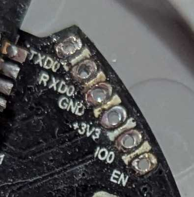
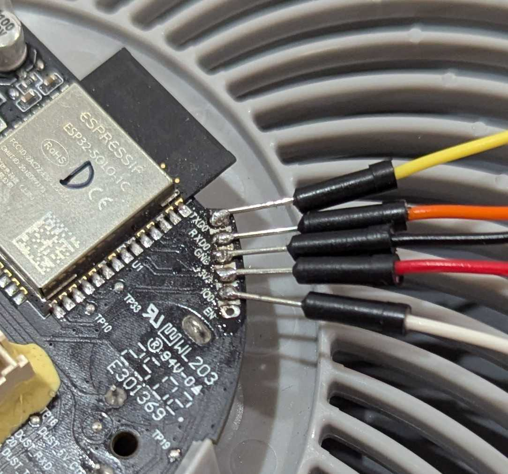
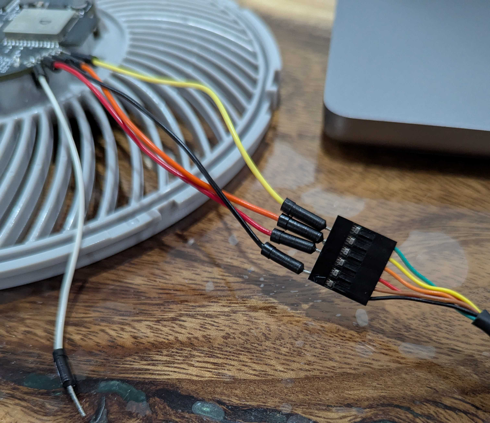
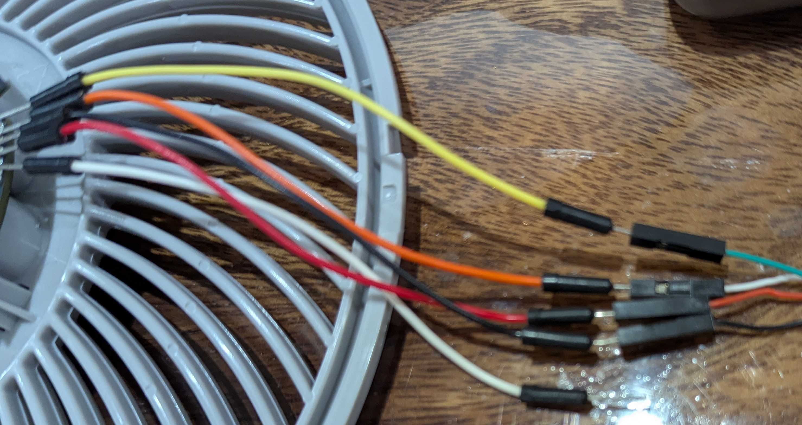
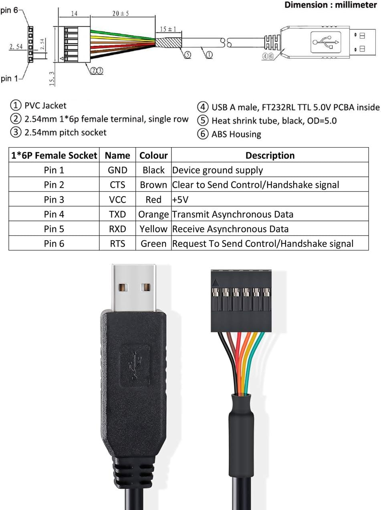

# Leviot

## Notes

Here lies my failed attempt to connect to and flash my levoit core 300s air purifier

- https://devices.esphome.io/devices/levoit-core-300s/
- https://github.com/acvigue/esphome-levoit-air-purifier
- https://esphome.io/guides/physical_device_connection/
- uart1 https://www.amazon.com.au/dp/B08763GK1Q?ref_=ppx_hzsearch_conn_dt_b_fed_asin_title_1
- uart2 https://www.amazon.com.au/dp/B0CJJ8PFLX?ref_=ppx_hzsearch_conn_dt_b_fed_asin_title_28
  
```sh
brew install uv
# uv add esphome
# uv add esptool

cp secrets.example.yaml secrets.yaml

uv run esptool read_flash 0 ALL levoit.bin

# sudo uv run esptool -p /dev/ttyUSB0 read-flash 0 ALL levoit.bin

# uv run esphome --dashboard run levoit-300s-configuration.yaml --device /dev/ttyUSB0
```

```sh
$ uv run esptool read-flash 0 ALL levoit.bin
> esptool v5.1.0
> Found 5 serial ports...
> Serial port /dev/cu.usbserial-2120:
> Connecting......................................
> /dev/cu.usbserial-2120 failed to connect: Failed to connect to Espressif device: No serial data received.
> For troubleshooting steps visit: https://docs.espressif.com/projects/esptool/en/latest/troubleshooting.html
```


```sh
$ uv run esptool read-flash 0 ALL levoit.bin
> esptool v5.1.0
> Found 5 serial ports...
> Serial port /dev/cu.usbserial-AB99H905:
> Connecting......................................
> /dev/cu.usbserial-AB99H905 failed to connect: Failed to connect to Espressif device: No serial data received.
> For troubleshooting steps visit: https://docs.espressif.com/projects/esptool/en/latest/troubleshooting.html
```








